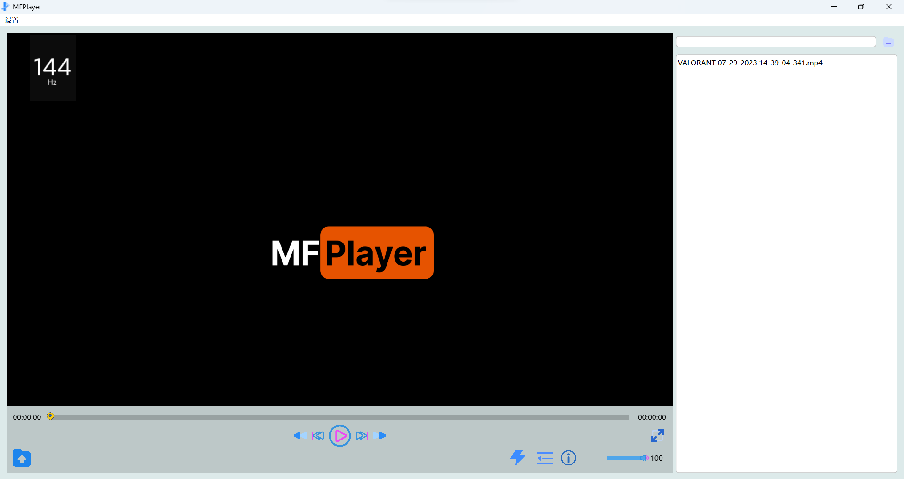
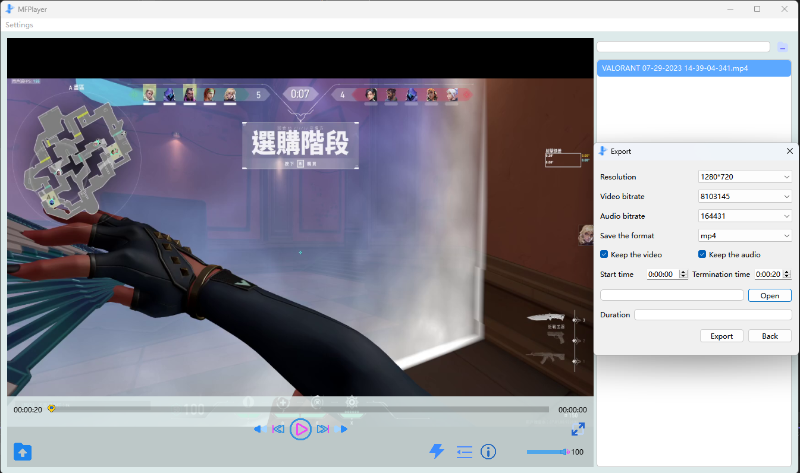

# MultiFormatPlayer
使用[ffmpeg](https://ffmpeg.org)和[Qt](https://www.qt.io)开发视频的播放器。支持多种视频格式，如mp4，avi,flv,f4v,ts,mov,wmv,3gp,3g2等，编码格式支持mp4,avi,flv,f4v,mov,ts等，如果想要自定义视频格式，请调整ffmpeg的编译选项以支持更多视频格式，它处于MultiFormatPlayer\MFPSinglePlayer\ffmpeg目录下，在源码中不提供完全静态链接库lib，所以你需要自己编译ffmpeg，然后将lib文件添加其中（注意，必须是包含所有数据的lib，在编译ffmpeg时需要注意）。当然你也可以用ffmpeg的lib与dll，但是必须注意，这个dll必须在运行目录下。本项目采用插件式开发，很容易将播放窗口嵌入到任意窗口中。
## 功能
    1.播放，暂停，快进，快退，上一帧，下一帧等基本视频播放功能。
    2.播放中调整视频的饱和度，亮度，对比度。
    3.导出视频（在导出过程中可以改变导出视频的时长，分辨率，比特率，格式等信息）。
    4.查看视频的基本信息。
    5.改变视频的音量。
    6.硬件解码。
    7.简体中文和English语言切换



### 项目结构
```
MultiFormatPlayer
├─ MFPluginBase
|  ├─ x64
|  |  ├─ Debug
|  |  └─ Release
│  ├─ MFPluginBase.cpp
│  ├─ MFPluginBase.h
│  ├─ MFPluginBase.vcxproj
│  ├─ MFPluginBase.vcxproj.filters
│  └─ mfpluginbase_global.h
├─ MFPSinglePlayer
|  ├─ x64
|  |  ├─ Debug
|  |  └─ Release
│  ├─ ffmpeg
│  ├─ FFmpeg.props
│  ├─ MFPAudioDecodeThread.cpp
│  ├─ MFPAudioDecodeThread.h
│  ├─ MFPAudioQueue.cpp
│  ├─ MFPAudioQueue.h
│  ├─ MFPAudioThread.cpp
│  ├─ MFPAudioThread.h
│  ├─ MFPControlSilder.cpp
│  ├─ MFPControlSilder.h
│  ├─ MFPDataBase.h
│  ├─ MFPExport.ui
│  ├─ MFPExportSettings.h
│  ├─ MFPFrameQueue.cpp
│  ├─ MFPFrameQueue.h
│  ├─ MFPInfomation.ui
│  ├─ MFPlayerDecodeThread.cpp
│  ├─ MFPlayerDecodeThread.h
│  ├─ MFPlayerEncoderThread.cpp
│  ├─ MFPlayerEncoderThread.h
│  ├─ MFPlayerThread.cpp
│  ├─ MFPlayerThread.h
│  ├─ MFPlayerWidget.cpp
│  ├─ MFPlayerWidget.h
│  ├─ MFPlayerWidget.ui
│  ├─ MFPOpenGLWidget.cpp
│  ├─ MFPOpenGLWidget.h
│  ├─ MFPSettings.ui
│  ├─ MFPSinglePlayer.cpp
│  ├─ MFPSinglePlayer.h
│  ├─ MFPSinglePlayer.vcxproj
│  ├─ MFPSinglePlayer.vcxproj.filters
│  ├─ mfpsingleplayer_global.h
│  ├─ MFPSTDClock.cpp
│  ├─ MFPSTDClock.h
│  ├─ MFPTranslation_en.qm
│  ├─ MFPTranslation_en.ts
│  ├─ MFPVideo.cpp
│  ├─ MFPVideo.h
│  └─ OpenCV.props
├─ MultiFormatPlayer
|  ├─ x64
|  |  ├─ Debug
|  |  └─ Release
│  ├─ default.png
│  ├─ DialogButtonRight.ui
│  ├─ logo.png
│  ├─ main.cpp
│  ├─ MFPMain.cpp
│  ├─ MFPMain.h
│  ├─ MFPMainWindow.cpp
│  ├─ MFPMainWindow.h
│  ├─ MFPMainWindow.qrc
│  ├─ MFPMainWindow.ui
│  ├─ MFPStyleSheet.qss
│  ├─ MFPTranslation_en.qm
│  ├─ MFPTranslation_en.ts
│  ├─ MultiFormatPlayer.sln
│  ├─ MultiFormatPlayer.vcxproj
│  ├─ MultiFormatPlayer.vcxproj.filters
│  ├─ settings - 副本.json
│  ├─ settings.json
│  └─ settingsDialog.ui
└─ res
```

## 使用

播放器采用插件式开发，如果想要在大型项目中使用（不建议），你只需要将MFPluginBase以及MFPSinglePlayer导入到自己的项目中，将生成的两个名为MFPluginBase.dll和MFPSinglePlayer.dll文件放入你的项目目录（如x64/Debug，x64/Debug/Plugins或x64/Release,x64/Release/Plugins）中然后加载插件即可。

你可以像我这样加载插件，在VS中，添加MFPluginBase到自己的项目中，然后将输出文件位置指向`$(SolutionDir)$(Platform)\$(Configuration)\`。
为了方便后续开发，在引入MFPSinglePlayer时，需要将输出指向`$(SolutionDir)$(Platform)\$(Configuration)\Plugins\`。

你也可以像添加MFPluginBase一样指向相同的路径，当然这样比较混乱。使用一下代码加载插件（这个代码只能加载一个插件，因为只有一个实例，所以提前返回了）。

如果你也想使用下面的代码，你可能需要修改pluginsDir的的路径，你可以调试看看它最终导向的是哪一个文件夹，只要保证这个文件夹里面有MFPSinglePlayer生成的dll文件即可。

### 插件导入代码
``` C++
    bool MFPMain::loadPlugin() {
    QDir pluginsDir(QCoreApplication::applicationDirPath());
#if defined(Q_OS_WIN)
    if (pluginsDir.dirName().toLower() == "debug" || pluginsDir.dirName().toLower() == "release")
        pluginsDir.cdUp();
#elif defined(Q_OS_MAC)
    if (pluginsDir.dirName() == "MacOS") {
        pluginsDir.cdUp();
        pluginsDir.cdUp();
        pluginsDir.cdUp();
    }
#endif
    pluginsDir.cd("Plugins");
    const QStringList entries = pluginsDir.entryList(QDir::Files);
    for (const QString& fileName : entries) {
        QPluginLoader* pluginLoader = new QPluginLoader(pluginsDir.absoluteFilePath(fileName));
        QObject* plugin = pluginLoader->instance();
        if (plugin) {
            mFPluginBase = qobject_cast<MFPluginBase*>(plugin);
            if (mFPluginBase)
                return true;
            pluginLoader->unload();
        }
    }

    return false;
}
```
### 接口
#### MFPPluginBase
名称     | 作用
-------- | -----
show()  | 显示MFPSinglePlayer
init(const QString& url)  | 初始化插件，参数为视频url
read(QJsonObject& obj)  | 传入json格式的配置文件
sendMessage(option o) | 用于通信，option是一个enum类型
getInstance() | 获取窗体

 `show()` 可以放在主程序的构造函数中。如果你想要传入一个`url`进行播放，调用顺序一般是先`read(url)`配置文件,随后`init()`插件。

例如
```c++
void MFPMain::onPlay(int index) {
	const QString url = history[index].toString();
	QJsonObject a = obj.value("singlePlayer").toObject();
	mFPluginBase->read(a);
	mFPluginBase->init(url);
	w->addPluginWidget(mFPluginBase->getInstance());\\将插件作为主程序的一部分进行显示
}
```
以上是基本的使用方法，你可以参考我的程序进行使用。如果使用过程中出现了问题或者其他建议欢迎提交问题。
## 参考
*   [ffmpeg](https://ffmpeg.org)
*   [QT](https://www.qt.io)
*   [OpenGL](https://www.opengl.org/)
*   [OpenCV](https://opencv.org/)