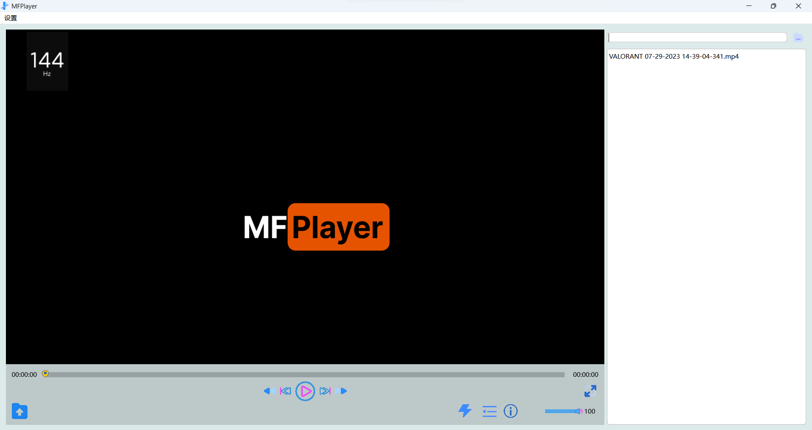

# MultiFormatPlayer
Develop a video player using [ffmpeg](https://ffmpeg.org) and [Qt](https://www.qt.io) that supports various video formats such as mp4, avi, flv, f4v, ts, mov, wmv, 3gp, 3g2, etc. The encoding formats include mp4, avi, flv, f4v, mov, ts, and more. If you want to customize video formats, adjust ffmpeg's compilation options to support additional formats. The relevant code is located in the MultiFormatPlayer\MFPSinglePlayer\ffmpeg directory. Complete static linking library (lib) is not provided in the source code, so you need to compile ffmpeg yourself and add the lib files (ensure it includes all necessary data). Alternatively, you can use ffmpeg's lib and dll, but note that the dll must be in the runtime directory. This project follows a plugin-based development approach, making it easy to embed the playback window into any desired window.

## Features
    1. Basic video playback functions: play, pause, fast forward, rewind, previous frame, next frame, etc.
    2. Adjust video saturation, brightness, and contrast during playback.
    3. Export videos (modify export settings such as duration, resolution, bitrate, format, etc. during export).
    4. View basic information about the video.
    5. Change the video's volume.
    6. Hardware decoding.
    7. Switch between Simplified Chinese and English languages.



### Project Structure
```
MultiFormatPlayer
├─ MFPluginBase
|  ├─ x64
|  |  ├─ Debug
|  |  └─ Release
│  ├─ MFPluginBase.cpp
│  ├─ MFPluginBase.h
│  ├─ MFPluginBase.vcxproj
│  ├─ MFPluginBase.vcxproj.filters
│  └─ mfpluginbase_global.h
├─ MFPSinglePlayer
|  ├─ x64
|  |  ├─ Debug
|  |  └─ Release
│  ├─ ffmpeg
│  ├─ FFmpeg.props
│  ├─ MFPAudioDecodeThread.cpp
│  ├─ MFPAudioDecodeThread.h
│  ├─ MFPAudioQueue.cpp
│  ├─ MFPAudioQueue.h
│  ├─ MFPAudioThread.cpp
│  ├─ MFPAudioThread.h
│  ├─ MFPControlSilder.cpp
│  ├─ MFPControlSilder.h
│  ├─ MFPDataBase.h
│  ├─ MFPExport.ui
│  ├─ MFPExportSettings.h
│  ├─ MFPFrameQueue.cpp
│  ├─ MFPFrameQueue.h
│  ├─ MFPInfomation.ui
│  ├─ MFPlayerDecodeThread.cpp
│  ├─ MFPlayerDecodeThread.h
│  ├─ MFPlayerEncoderThread.cpp
│  ├─ MFPlayerEncoderThread.h
│  ├─ MFPlayerThread.cpp
│  ├─ MFPlayerThread.h
│  ├─ MFPlayerWidget.cpp
│  ├─ MFPlayerWidget.h
│  ├─ MFPlayerWidget.ui
│  ├─ MFPOpenGLWidget.cpp
│  ├─ MFPOpenGLWidget.h
│  ├─ MFPSettings.ui
│  ├─ MFPSinglePlayer.cpp
│  ├─ MFPSinglePlayer.h
│  ├─ MFPSinglePlayer.vcxproj
│  ├─ MFPSinglePlayer.vcxproj.filters
│  ├─ mfpsingleplayer_global.h
│  ├─ MFPSTDClock.cpp
│  ├─ MFPSTDClock.h
│  ├─ MFPTranslation_en.qm
│  ├─ MFPTranslation_en.ts
│  ├─ MFPVideo.cpp
│  ├─ MFPVideo.h
│  └─ OpenCV.props
├─ MultiFormatPlayer
|  ├─ x64
|  |  ├─ Debug
|  |  └─ Release
│  ├─ default.png
│  ├─ DialogButtonRight.ui
│  ├─ logo.png
│  ├─ main.cpp
│  ├─ MFPMain.cpp
│  ├─ MFPMain.h
│  ├─ MFPMainWindow.cpp
│  ├─ MFPMainWindow.h
│  ├─ MFPMainWindow.qrc
│  ├─ MFPMainWindow.ui
│  ├─ MFPStyleSheet.qss
│  ├─ MFPTranslation_en.qm
│  ├─ MFPTranslation_en.ts
│  ├─ MultiFormatPlayer.sln
│  ├─ MultiFormatPlayer.vcxproj
│  ├─ MultiFormatPlayer.vcxproj.filters
│  ├─ settings - 副本.json
│  ├─ settings.json
│  └─ settingsDialog.ui
└─ res
```

## Usage


The player adopts a plugin-based development approach. If you intend to use it in a large-scale project (not recommended), you only need to import MFPluginBase and MFPSinglePlayer into your project. Place the generated two files named MFPluginBase.dll and MFPSinglePlayer.dll into your project directory (such as x64/Debug, x64/Debug/Plugins, or x64/Release, x64/Release/Plugins), and then load the plugins.

You can load the plugins like this: in Visual Studio, add MFPluginBase to your project, and then set the output file location to `$(SolutionDir)$(Platform)\$(Configuration)\`. For ease of future development, when introducing MFPSinglePlayer, you need to set the output to `$(SolutionDir)$(Platform)\$(Configuration)\Plugins\`.

Alternatively, you can set it to the same path as adding MFPluginBase, although this can be a bit messy. Use the following code to load the plugin (this code can only load one plugin because there is only one instance, so it returns early).

If you want to use the code below, you may need to modify the path of pluginsDir. You can debug to see which folder it ultimately points to, as long as that folder contains the generated DLL file for MFPSinglePlayer.

### Plugin Import Code
``` C++
bool MFPMain::loadPlugin() {
    QDir pluginsDir(QCoreApplication::applicationDirPath());
#if defined(Q_OS_WIN)
    if (pluginsDir.dirName().toLower() == "debug" || pluginsDir.dirName().toLower() == "release")
        pluginsDir.cdUp();
#elif defined(Q_OS_MAC)
    if (pluginsDir.dirName() == "MacOS") {
        pluginsDir.cdUp();
        pluginsDir.cdUp();
        pluginsDir.cdUp();
    }
#endif
    pluginsDir.cd("Plugins");
    const QStringList entries = pluginsDir.entryList(QDir::Files);
    for (const QString& fileName : entries) {
        QPluginLoader* pluginLoader = new QPluginLoader(pluginsDir.absoluteFilePath(fileName));
        QObject* plugin = pluginLoader->instance();
        if (plugin) {
            mFPluginBase = qobject_cast<MFPluginBase*>(plugin);
            if (mFPluginBase)
                return true;
            pluginLoader->unload();
        }
    }

    return false;
}
```

### Interfaces
#### MFPPluginBase
| Name                     | Purpose                                                   |
| ------------------------ | --------------------------------------------------------- |
| show()                   | Show MFPSinglePlayer.                                     |
| init(const QString& url) | Initialize the plugin, with the video URL as a parameter. |
| read(QJsonObject& obj)   | Read a JSON-format configuration file.                    |
| sendMessage(option o)    | Used for communication; option is an enum type.           |
| getInstance              |                                                           |

() | Get the window instance.

You can call `show()` in the main program's constructor. If you want to play a specific URL, the typical sequence is to first read the configuration file using `read(url)`, and then initialize the plugin using `init()`.

For example:
```c++
void MFPMain::onPlay(int index) {
    const QString url = history[index].toString();
    QJsonObject a = obj.value("singlePlayer").toObject();
    mFPluginBase->read(a);
    mFPluginBase->init(url);
    w->addPluginWidget(mFPluginBase->getInstance()); // Show the plugin as part of the main program
    //temp->show();
}
```

This covers the basic usage. Feel free to refer to my program for more guidance. If you encounter any issues or have other suggestions, please submit them.

## References
*   [ffmpeg](https://ffmpeg.org)
*   [QT](https://www.qt.io)
*   [OpenGL](https://www.opengl.org/)
*   [OpenCV](https://opencv.org/)

## **The above documents are translated by [chatgpt](https://openai.com/), if there is anything inappropriate, please point it out**.Thanks :-)